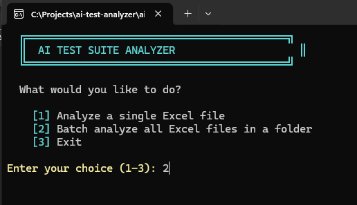
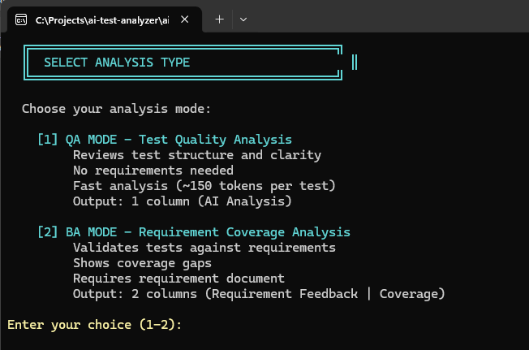
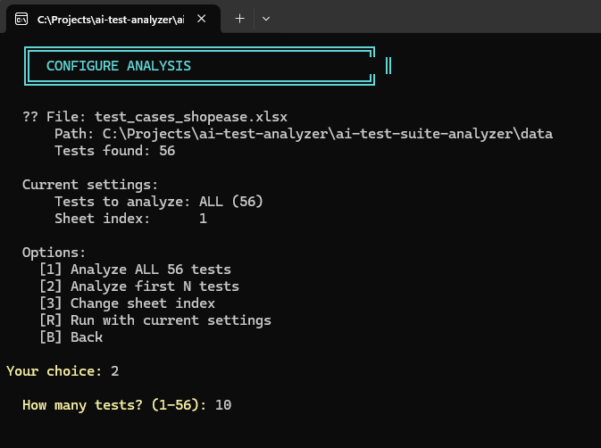
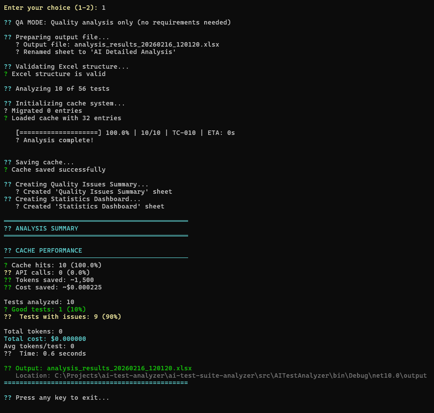
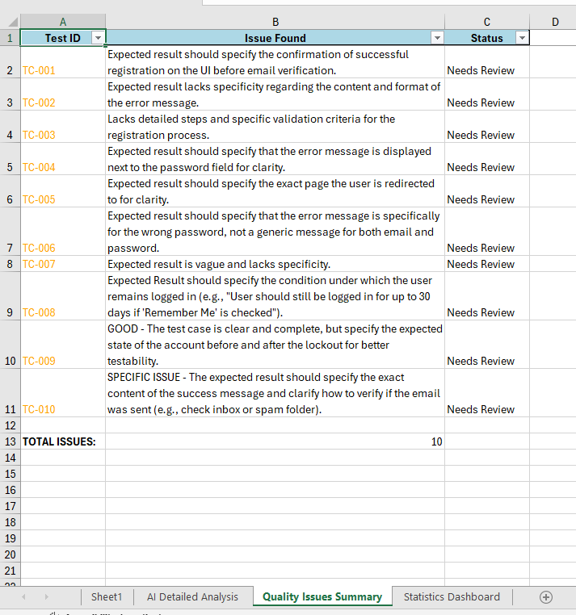
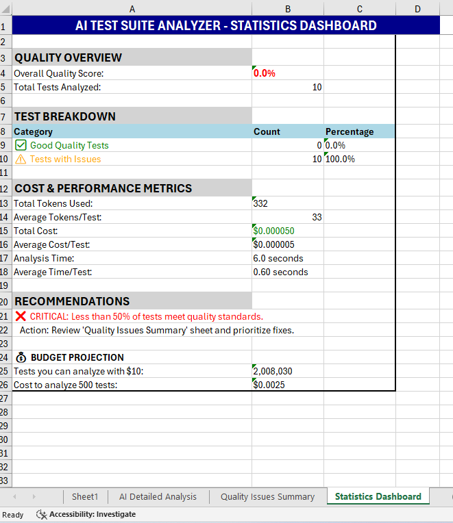
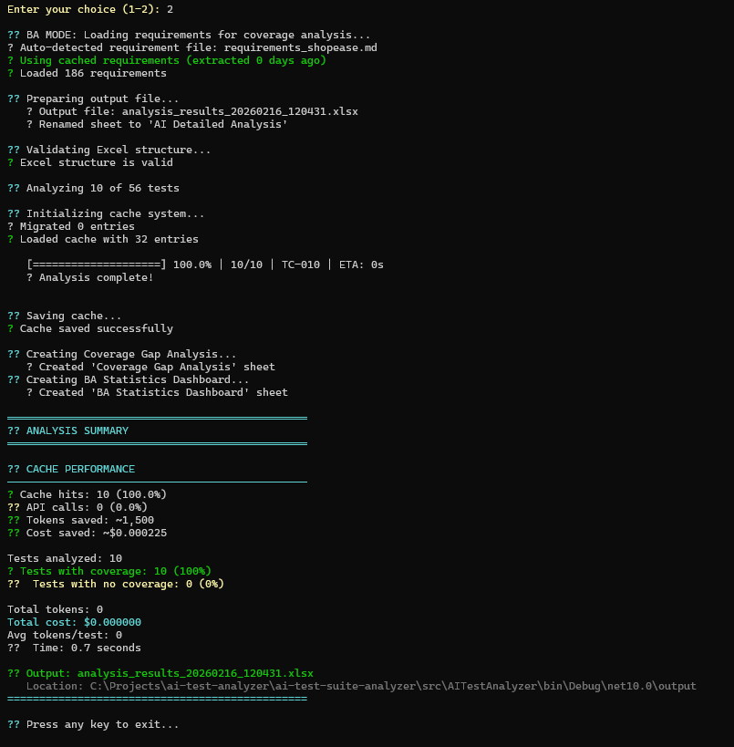
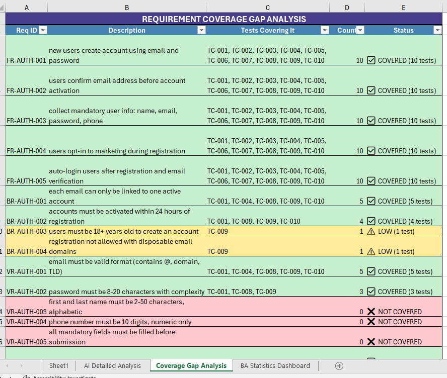
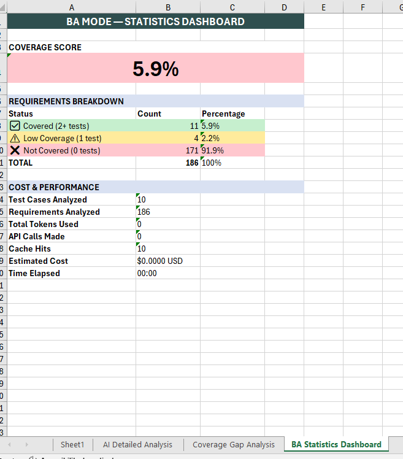

# AI Test Suite Analyzer

[](https://github.com/arvindhanqa/ai-test-suite-analyzer/actions/workflows/build.yml)

## 📺 Demo

[](https://youtu.be/RPSe74kPhn0)

> Full walkthrough: QA Mode, BA Mode, JSON export, caching (6 min)

---

> AI-powered test case quality analysis, requirement coverage validation, and AI test case generation — analyze 56 test cases for $0.001, generate new tests from requirements, re-run for free

An intelligent test analysis tool that reads Excel test cases, evaluates quality using AI, and validates requirement coverage. Supports two analysis modes for QA Engineers and Business Analysts.

---

## 🎯 Problem Statement

Manual test case review is:
- ⏰ **Time-consuming**: 5-10 minutes per test case
- 👁️ **Inconsistent**: Quality varies by reviewer
- 📈 **Not scalable**: Impossible to review 500+ test cases regularly
- 💼 **Expensive**: Senior QA time costs $50-100/hour
- 🕳️ **Gap-blind**: Hard to spot which requirements have no test coverage

**This tool solves all of that.**

---

## ✨ Features

### Dual Analysis Modes

The tool supports two distinct analysis modes depending on your role and goal:

#### QA Mode — Test Quality Analysis
For QA Engineers who want to assess test case quality without requirements.

- Analyzes each test for completeness, clarity, and best practices
- Single "AI Analysis" column output (blue header)
- Color-coded: Green = GOOD, Orange = Issues, Red = Errors
- ~150 tokens per test (~$0.001 for 56 tests)
- Full cache support (repeat runs = $0.00)

**Sample QA Mode output:**
```
TC-001  GOOD
TC-002  GOOD
TC-003  INCOMPLETE - Missing detailed requirements for user registration process.
TC-004  GOOD
```

#### BA Mode — Requirement Coverage Analysis
For Business Analysts and QA Leads who want to validate requirement coverage.

- Identifies which requirements each test covers
- Flags missing requirement coverage with actionable ❌ items
- Two-column output: "Requirement Feedback" (coral) + "Coverage" (green)
- Coverage shows specific requirement IDs (FR-AUTH-001, TM-003, etc.)
- ~800-1000 tokens per test (~$0.007 for 56 tests)
- Mode-aware cache (separate namespace from QA cache, repeat runs = $0.00)
- **Coverage Gap Analysis sheet** — one row per requirement showing which tests cover it

**Sample BA Mode output:**
```
Requirement Feedback                                          Coverage
❌ Email format validation missing (FR-AUTH-002) - add step  FR-AUTH-001, FR-AUTH-002
❌ Password strength validation missing (FR-AUTH-003)...
❌ Age confirmation checkbox validation missing (BR-AUTH-001)
```

**Coverage Gap Analysis sheet:**
```
Req ID       Description                    Tests Covering It    Count  Status
FR-AUTH-001  new users create account...    TC-001, TC-002       5      ✅ COVERED (5 tests)
BR-AUTH-001  each email linked to one...                         0      ❌ NOT COVERED
VR-AUTH-001  email must be valid format...                       0      ❌ NOT COVERED
```

#### GEN Mode — AI Test Case Generation 🆕
For QA Engineers and Test Architects who need a first draft of test cases from a requirements document.

GEN Mode reads a requirements markdown file and runs a **Generate → Critique → Refine** loop (up to 3 passes) to produce test cases, then automatically scores each one using QA Mode.

- Generates test cases (positive, negative, and boundary scenarios) from any `.md` or `.txt` requirements file
- Self-critiques its own output — flags each test case as KEEP, REVISE, or DROP
- Refines flagged test cases up to 2 additional passes, converging early when all critiques are KEEP
- Auto-scores every generated test case via QA Mode (color-coded GOOD / Issues / Errors)
- Outputs to Excel ("Generated Tests" sheet + "Gen Statistics Dashboard") and optional JSON
- Hash-based caching — re-run with same requirements + settings = instant, $0.00
- Uses `gpt-4.1-mini` (1M token context) for better instruction following on complex generation prompts

**How to run:**

Via the interactive menu:
```
[3] Generate test cases — GEN Mode
```

Or skip the menu entirely:
```bash
dotnet run -- --gen-mode
```

**The Generate → Critique → Refine loop:**
```
┌─────────────┐     ┌──────────────┐     ┌─────────────┐
│   GENERATE  │────▶│   CRITIQUE   │────▶│   REFINE    │
│  (Pass 1)   │     │ KEEP/REVISE/ │     │ (Pass 2-3)  │
│             │     │     DROP     │     │             │
└─────────────┘     └──────┬───────┘     └──────┬──────┘
                            │                     │
                     All KEEP? ──Yes──▶ Done ◀────┘
                            │
                            No
                            ▼
                  Loop until MaxPasses
                  or all critiques KEEP
                            │
                            ▼
                  ┌────────────────────┐
                  │  AUTO QA SCORING   │
                  │ (every test case)  │
                  └─────────┬──────────┘
                             │
                             ▼
                   Excel + JSON Output
```

**Sample Generated Tests output:**

| Test ID | Feature | Scenario | Priority | Pass | QA Score |
|---|---|---|---|---|---|
| TC-GEN-001 | User Registration | Register with valid email and password | High | 1 | GOOD |
| TC-GEN-002 | User Registration | Attempt registration with duplicate email | High | 1 | GOOD |
| TC-GEN-003 | User Registration | Password below minimum length boundary | High | 2 | GOOD - Specify exact error message |

---

### Core Capabilities
- 📊 **AI-Powered Analysis**: Uses GPT-4o-mini to evaluate test quality and requirement coverage
- 📈 **Multi-Sheet Excel Output**: Separate sheets for detailed analysis, issues, and statistics
- 📄 **JSON Export**: Export results as JSON for CI/CD pipeline integration (`--format json`)
- ⚡ **Real-Time Progress**: Visual progress bar with ETA calculation
- 💰 **Cost-Optimized**: 84% token reduction through prompt engineering
- 🎨 **Color-Coded Feedback**: Green for good tests, orange for issues, red for errors
- 📋 **Actionable Insights**: Specific, concise improvement suggestions per test
- 🔄 **Retry Logic**: Automatic retry with exponential backoff for API failures
- ✅ **Excel Validation**: Column header and data pre-flight checks before processing
- 🎯 **Professional Output**: Freeze panes, auto-filters, optimized column widths
- 💾 **Batch Checkpoint/Resume**: Resume interrupted batch runs with `--resume`
- 🔍 **Dry-Run Preview**: Estimate cost before running with the `D` key at the prompt
- 🤖 **GEN Mode**: AI test case generation via Generate → Critique → Refine loop (`--gen-mode`)
- 📑 **Gen Statistics Dashboard**: Generation summary, QA score breakdown, cost and performance metrics

---

### Interactive File Selector

No command-line arguments needed. An interactive menu guides you through everything:

```
  AI TEST SUITE ANALYZER

  What would you like to do?

	[1] Analyze a single Excel file — QA Mode
	[2] Analyze a single Excel file — BA Mode
	[3] Generate test cases — GEN Mode 🆕
	[4] Batch analyze all Excel files in a folder
	[5] Exit
```
```
Analysis mode is selected upfront — no separate mode screen needed for single-file QA/BA runs.
```

**Ready-to-run confirmation prompt:**
```
─── Ready to run ───────────────────────────────────
   File:        test_cases_shopease.xlsx
   Mode:        QA
   Sheet:       0
   Tests:       ALL
   Cache:       Enabled
────────────────────────────────────────────────────

  Press Enter to analyze, D for dry-run preview, B to go back:
```

**Single file flow:**
- Auto-discovers Excel files in common project locations
- Shows test count before you commit to running
- Configure test limit and sheet index from the menu

**Batch flow:**
- Discovers folders containing Excel files
- Applies selected mode across all files in folder
- Shared cache across files for maximum cost savings

---

### Intelligent Requirement Auto-Detection (BA Mode)

BA Mode automatically finds the matching requirements file based on your test file name:

```
test_cases_taskflow.xlsx  →  auto-finds  requirements_taskflow.md
test_cases_shopease.xlsx  →  auto-finds  requirements_shopease.md
```

If the file isn't found, you're prompted to enter the path manually. Requirements are extracted once via AI and cached — subsequent runs use cached requirements at zero cost.

---

### Intelligent Caching System

A production-ready dual-layer cache system:

**Test Analysis Cache (QA + BA)**
- Content-aware: Tests cached by SHA256 hash of test content (not Test ID)
- Mode-separated: QA results use plain hash, BA results use `ba_` prefix hash — no collisions
- 30-day expiry with automatic cleanup
- Persistent across application restarts
- Async save (`SaveCacheAsync`) for non-blocking I/O

**Requirement Cache**
- Requirement documents extracted once, cached by file path + modification date
- Subsequent BA Mode runs load requirements instantly at $0.00

**Real-world impact:**
- First run (56 tests, BA Mode): ~$0.007, ~3 minutes
- Second run (same tests): $0.00, ~4 seconds ⚡
- Batch (2 files, 100% cached): $0.00, 3.7 seconds for 20 tests

---

### Batch Processing

Process multiple Excel files in a single run with full mode support:

- **Multi-File Processing**: Analyze entire folders in one command
- **Mode Consistent**: Selected mode (QA/BA) applies to all files in batch
- **Separate Output Files**: Each input file gets its own timestamped report
- **Shared Cache**: Cache works across files — same test in two files = one API call
- **Aggregate Statistics**: Combined summary across all files
- **Checkpoint/Resume**: Interrupted batch runs can be resumed with `--resume`

**Example batch summary:**
```
┌─────────────────────────────────┬────────┬─────────┬────────┬──────────┬────────────┐
│ File                            │ Tests  │ Quality │ Cache  │ Tokens   │ Cost       │
├─────────────────────────────────┼────────┼─────────┼────────┼──────────┼────────────┤
│ test_cases_shopease.xlsx        │     10 │   0.0%  │  10/10 │        0 │ $0.000000  │
│ test_cases_taskflow.xlsx        │     10 │   0.0%  │  10/10 │        0 │ $0.000000  │
└─────────────────────────────────┴────────┴─────────┴────────┴──────────┴────────────┘

📈 AGGREGATE STATISTICS
   Files processed:     2
   Total tests:         20
   Cache hits:          20 (100.0%)
   Total cost:          $0.000000
   Total time:          3.7 seconds
```

---

### JSON Export

Export analysis results as JSON for CI/CD pipeline integration:

```bash
dotnet run -- --format json
```

Output file is created alongside the Excel report:

```json
{
  "metadata": {
    "generatedAt": "2026-03-14T00:11:17",
    "analysisMode": "QA",
    "totalTests": 56,
    "cacheHits": 48,
    "apiCalls": 8,
    "totalTokens": 1200,
    "estimatedCostUsd": 0.00018,
    "durationSeconds": 12.4
  },
  "summary": {
    "goodTests": 42,
    "testsWithIssues": 14,
    "errors": 0,
    "qualityScorePct": 75.0
  },
  "results": [
    { "testId": "TC-001", "analysis": "GOOD - clear steps and expected result", "coverage": "", "tokens": 0 }
  ]
}
```

Use in CI/CD to fail a build if `qualityScorePct` drops below a threshold.

---

## 🏗️ Architecture

```
FileSelector (Interactive Menu + Mode Selection)
       ↓
  [QA Mode]        [BA Mode]              [GEN Mode]
      ↓                ↓                       ↓
ExcelReader   RequirementExtractor    GenModeOrchestrator
      ↓         → RequirementCache         ↓
AIAnalyzer.   AIAnalyzer.Analyze     Generate → Critique → Refine
AnalyzeTest   CoverageAndFeedback    (TestCaseCache gen_ prefix)
Quality            ↓                       ↓
      ↓      TestCaseCache (ba_)     Auto QA Scoring
TestCaseCache       ↓                       ↓
      ↓      ExcelWriter (2 cols    GenModeExcelWriter
ExcelWriter    + Gap Sheet)          (Generated Tests +
(1 column)          ↓                Gen Stats Dashboard)
      ↓      [Requirement Feedback         ↓
[AI Analysis  + Coverage + Gap]      JsonExporter (GEN)
 Sheet]
      ↓
JsonExporter (optional --format json)

BatchProcessor → Applies selected mode across all files → Aggregate Summary
CheckpointManager → Saves progress after each file → Resume with --resume

DI Container (BuildServiceProvider) → Resolves IAIAnalyzer, ITestCaseCache,
                                       IRequirementExtractor, BatchProcessor,
                                       GenModeOrchestrator
```

### Code Structure
```
AITestAnalyzer/
├── Program.cs                      # Entry point + DI container + mode routing
├── Config/
│   ├── AnalysisMode.cs             # Top-level enum (QA / BA)
│   └── Constants.cs                # All magic numbers and string constants
├── Models/
│   ├── Configuration.cs            # App configuration model
│   ├── ExtractedRequirement.cs     # Requirement data model
│   ├── PromptConfig.cs             # AI prompt configuration + cost per token
│   ├── TestCase.cs                 # Test case data model
│   ├── GeneratedTestCase.cs        # GEN Mode: generated test case + pass number + QA score
│   ├── CritiqueResult.cs           # GEN Mode: KEEP/REVISE/DROP critique result
│   └── GenModeResult.cs            # GEN Mode: full pipeline result + token tracking
├── Services/
│   ├── AIAnalyzer.cs               # OpenAI integration (QA, BA, GEN Mode methods)
│   ├── IAIAnalyzer.cs              # Interface for AI analysis
│   ├── BatchProcessor.cs           # Multi-file batch (mode-aware + checkpoint)
│   ├── ConfigurationValidator.cs   # Startup validation (API key + PromptConfig)
│   ├── ExcelReader.cs              # Excel reading + validation (single file open)
│   ├── IExcelReader.cs             # Interface for Excel reading
│   ├── ExcelWriter.cs              # Mode-aware Excel writing + buffered flush
│   ├── IExcelWriter.cs             # Interface for Excel writing
│   ├── GenModeOrchestrator.cs      # GEN Mode: Generate → Critique → Refine → QA Score loop
│   ├── GenModeExcelWriter.cs       # GEN Mode: output file orchestration
│   ├── JsonExporter.cs             # JSON export for CI/CD integration (QA/BA + GEN)
│   ├── RequirementExtractor.cs     # AI requirement extraction
│   └── IRequirementExtractor.cs    # Interface for requirement extraction
├── Infrastructure/
│   ├── BatchCheckpoint.cs          # Checkpoint data model
│   ├── CheckpointManager.cs        # Save/load/delete checkpoint state
│   ├── ITestCaseCache.cs           # Interface for test case cache
│   ├── ProgressTracker.cs          # Real-time progress display
│   ├── RequirementCache.cs         # Requirement document cache
│   ├── RetryHelper.cs              # Generic retry with exponential backoff
│   └── TestCaseCache.cs            # Dual-mode cache (QA + BA namespaces)
└── UI/
    ├── FileSelector.cs             # Interactive menu + mode selection
    └── SummaryDisplay.cs           # Console output formatting
```

**Key Design Principles:**
- ✅ Single Responsibility (each class has one job)
- ✅ Interface-driven design — 5 service interfaces for testability
- ✅ Dependency Injection via `Microsoft.Extensions.DependencyInjection`
- ✅ Modular "lego block" architecture — modes snap in cleanly
- ✅ Context-aware analysis (93% API cost reduction vs separate passes)
- ✅ Backward-compatible cache migration
- ✅ Buffered Excel I/O (~110 file operations → ~4 per run)
- ✅ Async I/O for cache persistence (`SaveCacheAsync`)

---

## 📦 Installation

### Prerequisites
- Visual Studio 2022 (or later)
- .NET 10.0 SDK
- OpenAI API Key ([Get one here](https://platform.openai.com))

### Setup Steps

1. **Clone the repository**
```bash
git clone https://github.com/arvindhanqa/ai-test-suite-analyzer.git
cd ai-test-suite-analyzer
```

2. **Configure API Key**
```bash
cd src/AITestAnalyzer
cp appsettings.json.sample appsettings.json
```

Edit `appsettings.json`:
```json
{
  "OpenAI": {
    "ApiKey": "YOUR-API-KEY-HERE",
    "Model": "gpt-4o-mini"
  }
}
```

3. **Install Dependencies**
```bash
dotnet restore
```

4. **Build and Run**
```bash
dotnet build
dotnet run
```

The interactive menu handles everything from here.

---

## Usage

### Interactive Mode (Default)
```bash
dotnet run
```

### JSON Export
```bash
dotnet run -- --format json    # Export results as JSON alongside Excel
```

### Cache Controls
```bash
dotnet run -- --no-cache       # Force fresh analysis
dotnet run -- --clear-cache    # Clear all cached results
```

### Batch Resume
```bash
dotnet run -- --resume         # Resume interrupted batch run
```

### GEN Mode
```bash
dotnet run -- --gen-mode       # Launch GEN Mode directly, skipping the main menu
```


### Help and Version
```bash
dotnet run -- --help
dotnet run -- --version
```

---

## 💰 Cost Analysis

### QA Mode Token Usage

| Version | Tokens/Test | Cost/Test | 56 Tests |
|---------|-------------|-----------|----------|
| Initial (Verbose) | 750 | $0.000113 | $0.0063 |
| Optimized | 154 | $0.000023 | $0.0013 |
| **With Cache (100% Hit)** | **0** | **$0.00** | **$0.00** ⚡ |

### BA Mode Token Usage

| Scenario | Tokens/Test | Cost/Test | 56 Tests |
|----------|-------------|-----------|----------|
| Fresh analysis | ~900 | $0.000135 | $0.0075 |
| **With Cache (100% Hit)** | **0** | **$0.00** | **$0.00** ⚡ |

### Real-World Cost Scenarios

| Scenario | Tests | Mode | Cost | Time |
|----------|-------|------|------|------|
| First run | 56 | QA | ~$0.001 | ~2 min |
| First run | 56 | BA | ~$0.007 | ~3 min |
| Re-run (100% cached) | 56 | QA or BA | $0.00 | ~0.4s |
| Batch (2 files, first run) | 86 | BA | ~$0.012 | ~5 min |
| Batch (2 files, 100% cached) | 86 | BA | $0.00 | ~4s |

**Your $10 OpenAI budget covers hundreds of fresh full-suite analyses — or virtually unlimited re-runs with cache.**

---

## 🛠️ Technology Stack

- **Language**: C# (.NET 10.0)
- **Excel Processing**: EPPlus 7.x
- **AI Integration**: Betalgo.OpenAI 8.7.2
- **AI Models**: GPT-4o-mini (QA/BA Mode), GPT-4.1-mini (GEN Mode — 1M token context)
- **Temperature**: 0.2 across all modes
- **JSON Export**: System.Text.Json
- **Configuration**: Microsoft.Extensions.Configuration
- **Dependency Injection**: Microsoft.Extensions.DependencyInjection
- **Testing**: xUnit + FluentAssertions + Moq
- **CI/CD**: GitHub Actions
- **Platform**: Windows 10/11

---

## 📋 Project Structure
```
ai-test-suite-analyzer/
├── src/
│   └── AITestAnalyzer/
│       ├── Program.cs
│       ├── Config/
│       │   ├── AnalysisMode.cs
│       │   └── Constants.cs
│       ├── Models/
│       │   ├── Configuration.cs
│       │   ├── ExtractedRequirement.cs
│       │   ├── PromptConfig.cs
│       │   ├── TestCase.cs
│       │   ├── GeneratedTestCase.cs
│       │   ├── CritiqueResult.cs
│       │   └── GenModeResult.cs
│       ├── Services/
│       │   ├── AIAnalyzer.cs + IAIAnalyzer.cs
│       │   ├── BatchProcessor.cs
│       │   ├── ConfigurationValidator.cs
│       │   ├── ExcelReader.cs + IExcelReader.cs
│       │   ├── ExcelWriter.cs + IExcelWriter.cs
│       │   ├── GenModeOrchestrator.cs
│       │   ├── GenModeExcelWriter.cs
│       │   ├── JsonExporter.cs
│       │   └── RequirementExtractor.cs + IRequirementExtractor.cs
│       ├── Infrastructure/
│       │   ├── BatchCheckpoint.cs
│       │   ├── CheckpointManager.cs
│       │   ├── ITestCaseCache.cs
│       │   ├── ProgressTracker.cs
│       │   ├── RequirementCache.cs
│       │   ├── RetryHelper.cs
│       │   └── TestCaseCache.cs
│       ├── UI/
│       │   ├── FileSelector.cs
│       │   └── SummaryDisplay.cs
│       ├── appsettings.json
│       └── PromptConfig.json
├── tests/
│   ├── AITestAnalyzer.Tests/            # Unit tests (31 tests)
│   │   ├── AIAnalyzerTests.cs           # incl. GEN Mode parsing + interface tests
│   │   ├── ExcelReaderTests.cs
│   │   ├── ConfigurationValidatorTests.cs
│   │   └── TestCaseCacheTests.cs
│   └── AITestAnalyzer.IntegrationTests/ # Integration tests (12 tests)
│       ├── PipelineTests.cs             # incl. GEN Mode full pipeline, critique loop, cache hit
│       └── TestData/
│           └── test_cases_shopease.xlsx
├── data/
│   ├── requirements_shopease.md
│   ├── test_cases_shopease.xlsx
│   ├── requirements_taskflow.md
│   └── test_cases_taskflow.xlsx
├── cache/                          # Cache storage (gitignored)
│                                    # includes test_analysis_cache.json + gen_mode_cache.json
├── output/                         # Generated analysis reports
├── .editorconfig                   # Code formatting standards
├── CHANGELOG.md                    # Version history
└── README.md
```

---

## 📸 Screenshots

### 🖥️ Interactive Menu
| Main Menu | Analysis Type Selection |
|-----------|------------------------|
|  |  |

### ⚙️ Configure Analysis


### 🤖 QA Mode — Console Output


### 📊 QA Mode — Excel Output
| Quality Issues Summary | Statistics Dashboard |
|----------------------|---------------------|
|  |  |

### 🎯 BA Mode — Console Output


### 📋 BA Mode — Excel Output
| Coverage Gap Analysis | BA Statistics Dashboard |
|----------------------|------------------------|
|  |  |

---

## 🎯 Roadmap

### Phase 1 ✅ COMPLETE (Days 1-14)
- [x] Environment setup and test data creation
- [x] Excel reading with EPPlus
- [x] OpenAI API integration (GPT-4o-mini)
- [x] Cost optimization (84% token reduction)
- [x] Professional code architecture
- [x] Multi-sheet Excel output with color coding
- [x] Real-time progress bar with ETA
- [x] Statistics dashboard
- [x] Error handling with automatic retry logic
- [x] Intelligent cache system (content-aware, 30-day expiry)
- [x] Batch processing (multiple Excel files)
- [x] Interactive FileSelector menu

### Phase 2 ✅ COMPLETE (Days 15-20)
- [x] Requirement extraction via AI (pipe-delimited, compressed format)
- [x] Requirement caching system
- [x] Context-aware test analysis (93% cost reduction vs separate passes)
- [x] QA Mode — quality-only analysis
- [x] BA Mode — requirement coverage gap analysis
- [x] Auto-detection of requirement files from test file naming
- [x] Coverage column in Excel output (color-coded, ID-based)
- [x] Dual-mode cache (separate QA/BA namespaces, no collisions)
- [x] Batch mode fully mode-aware (QA/BA across all files)

### Phase 3 ✅ COMPLETE (Days 21-26)
- [x] Coverage Gap Analysis sheet — color-coded per-requirement status
- [x] BA Statistics Dashboard sheet
- [x] Fix FormatRequirements to include IDs in AI prompt (BUG-1)
- [x] Dead code cleanup

### Phase 4 ✅ IN PROGRESS (Days 27-90)
- [x] All 9 code review bugs closed (BUG-1 through BUG-9)
- [x] Performance: ExcelReader opens file once for all rows (BUG-2)
- [x] Performance: ExcelWriter buffers all writes, single flush (BUG-3)
- [x] Batch checkpoint/resume with `--resume` flag (MI-5)
- [x] RetryHelper — generic reusable retry with exponential backoff (MI-7)
- [x] Dry-run cost preview — press D before analysis starts (MI-4)
- [x] .editorconfig — consistent code formatting (ME-1)
- [x] CHANGELOG.md — version history (ME-2)
- [x] 0 compiler warnings (ME-3)
- [x] Async suffix on all async methods (CS-2)
- [x] Constants.cs — no magic numbers or strings (CS-4)
- [x] AnalysisMode promoted to top-level enum (CS-5)
- [x] JSON export with `--format json` flag (EN-3)
- [x] 5 service interfaces — IExcelReader, IExcelWriter, IAIAnalyzer, IRequirementExtractor, ITestCaseCache (TD-1)
- [x] Dependency injection container with Microsoft.Extensions.DI (ME-10)
- [x] SaveCacheAsync — async cache persistence (TD-2)
- [x] Improved error messages across all classes (TD-4)
- [x] Mock-based unit tests with Moq — 21 unit tests passing
- [x] Integration test project — 5 end-to-end tests passing (TD-5)
- [x] Folder structure reorganisation — Config/, Models/, Services/, Infrastructure/, UI/ (Issue #33)
- [ ] v1.0.0 release tag — Week 13
- [ ] Video demo — Week 13
- [ ] LinkedIn launch post — Week 13

### Future (Post April 19)
- [ ] Web interface (Blazor)
- [ ] JIRA/TestRail integration
- [ ] Local LLM support (Ollama)
- [ ] Test case generation from requirements (v2.0)

---

## 👤 Author

**Aravindhan Rajasekaran**
- **Current Role**: Lead Test Engineer @ Acumatica (2020-Present)
- **Experience**: 13+ years in QA, Test Automation, and Software Development
- **Expertise**: C#, Java, Python, Selenium, API Testing, CI/CD
- **Certifications**: ISTQB Certified, Certified Scrum Master
- **GitHub**: [@arvindhanqa](https://github.com/arvindhanqa)
- **LinkedIn**: [linkedin.com/in/aravindrajsekar](https://www.linkedin.com/in/aravindrajsekar)
- **Location**: Saskatoon, Saskatchewan, Canada

### Notable Achievements
- 🏆 Increased test automation coverage from 15% to 95% (3,000 automated tests)
- 🏆 Reduced production bugs from 50 to 5 per month through Test SOP implementation
- 🏆 Led distributed QA teams across USA, Serbia, and Sri Lanka
- 🏆 Created in-house test coverage calculator tool
- 🏆 Automated 500+ scenarios for 22 new features with 100% coverage

---

## 🤝 About This Project

This is a personal project built as part of a 90-day commitment (January 20 - April 19, 2026) to build practical AI-powered tooling and demonstrate the ability to ship complete software from concept to production.

**Status (Day 80)**: Phase 4 in progress. Folder reorganisation complete. 26 tests passing (21 unit + 5 integration). 80 consecutive days of commits — streak unbroken.

### Development Progress
- **Days 1-7**: Foundation — setup, data, Excel processing, OpenAI integration, cost optimization
- **Days 8-14**: Professional features — progress bar, caching, error handling, CLI, batch processing, interactive menu
- **Days 15-20**: Intelligence — requirement extraction, dual-mode analysis (QA/BA), coverage tracking
- **Days 21-26**: Polish — Coverage Gap Analysis sheet, BA Statistics Dashboard
- **Days 27-55**: Quality — all bugs fixed, performance improvements, code standards, JSON export
- **Days 56-76**: Architecture — 5 interfaces, DI container, async I/O, improved errors, 26 tests passing
- **Days 77-80**: Structure — folder reorganisation (Config/, Models/, Services/, Infrastructure/, UI/)

---

## 📝 License

MIT License - Feel free to use and modify for your own projects.

---

## 🙏 Acknowledgments

Built with:
- OpenAI GPT-4o-mini for intelligent test analysis
- EPPlus for Excel manipulation
- Visual Studio 2022 for development

---

**⭐ If you find this useful, please star the repository!**

---

*Last Updated: April 14, 2026 (Day 85)*